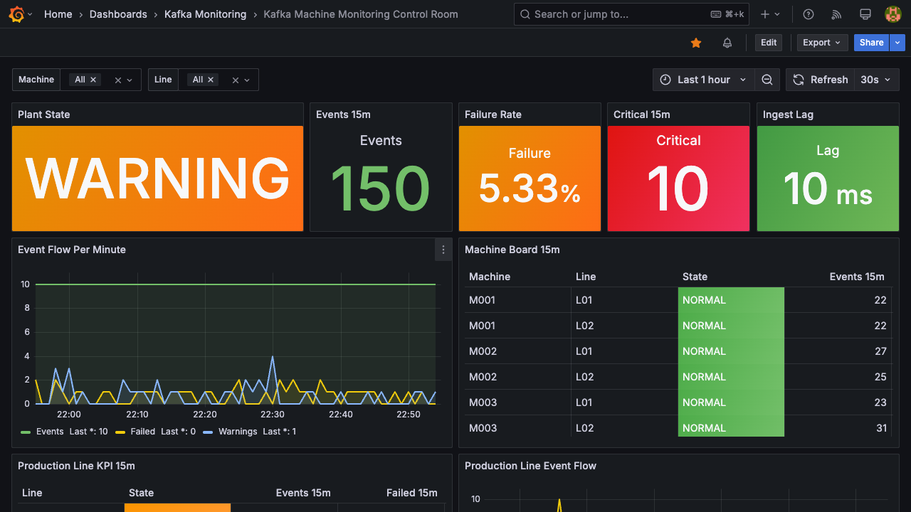

# Kafka Real-Time Manufacturing Monitoring

This project shows how a manufacturing team can monitor machine events in near real time using Kafka, PostgreSQL, and Grafana.

The business story is a QR-printing production line that continuously emits Fabric-aligned events: print quality checks, telemetry, and machine fault logs. The goal is to help an operations team quickly answer:

- Are production events still flowing?
- Which machines or lines need attention?
- Are failures, warnings, or high temperatures increasing?
- Is the dashboard showing fresh data?
- Can the same event stream support future analytics?



## Business Logic

The project treats each machine event as an operational signal. Events are streamed, stored, checked against monitoring rules, and shown in a control-room dashboard.

The dashboard highlights:

- Plant status: `NORMAL`, `WARNING`, `CRITICAL`, or `NO_DATA`
- Recent event volume
- Failure rate
- Critical alert count
- Ingest lag
- Machine-level status
- Recent alert feed

This makes the demo useful for monitoring current production health, not just reporting historical results.

## Business Layer

The business layer is organized around production operations:

| Layer | Purpose |
| --- | --- |
| Machine events | Simulated `LINE_01` / `QR_PRINTER_01` signals such as `PRINT_EVENT`, `MACHINE_TELEMETRY`, `MACHINE_LOG`, `SUCCESS`, `FAILED`, and `FAULTED`. |
| Monitoring rules | Thresholds for failure rate, warning volume, temperature, and ingest lag. |
| Control-room views | PostgreSQL views that convert raw events into current plant status, machine status, and alert feed. |
| Grafana dashboard | A live operations dashboard for supervisors or support teams. |

## Solution Architecture

```text
Machine event simulator
        |
        v
Python producer
        |
        v
Kafka topic: machine_events
        |
        v
Python consumer
        |
        v
PostgreSQL operational store
        |
        v
PostgreSQL monitoring views
        |
        v
Grafana control-room dashboard
```

Kafka is used as the event backbone. PostgreSQL is used as the operational serving layer so Grafana can query clean, trusted views. Grafana is used for monitoring, visual status, and alert visibility.

The same architecture can later be extended to send Kafka events into BigQuery, Databricks, Fabric, or another historical analytics platform.

## Tech Stack

- Apache Kafka for event streaming
- Python producer and consumer services
- PostgreSQL for operational storage and SQL monitoring views
- Grafana for the real-time dashboard and alert rules
- Gmail SMTP for searchable operational alert history
- LINE Messaging API for fast mobile alert notification
- Docker Compose for local orchestration
- GCP Compute Engine for optional cloud demo deployment
- DBeaver for SQL inspection and validation

## Current Status

The local pipeline is working end to end:

```text
Producer -> Kafka -> Consumer -> PostgreSQL -> Grafana
```

The project also has a tested GCP VM deployment path. The VM can be stopped when not in use to control cost.

Gmail alerting is also configured and verified:

```text
Grafana alert rule -> Gmail email contact point -> pattaratua@gmail.com
```

The current email alert format includes status, severity, impact, action plan, dashboard link, and resolution note. Gmail is used as the official searchable alert record.

LINE alerting is prepared and the first real LINE Messaging API test passed:

```text
Kafka Alert Bot -> LINE Messaging API broadcast -> LINE Official Account friends
```

LINE is the fast mobile response channel. Gmail remains the official alert-history channel.

## Grafana Access

Public dashboard:

```text
http://136.110.54.120:3000/d/kafka-machine-monitoring/kafka-machine-monitoring-control-room
```

The public dashboard opens in anonymous viewer mode, so visitors do not need to register or log in.

Grafana alert emails use this VM public base URL for dashboard links:

```text
http://136.110.54.120:3000
```

Local dashboard:

```text
http://localhost:3000
```

The public URL is available while the GCP VM is running. The VM can be stopped when the demo is not needed to control cost.

Default local admin login:

```text
admin / admin
```

## Explore More

For deeper technical details, use these documents:

- [Technical README](docs/technical_readme.md)
- [Implementation details](docs/project_implementation_details.md)
- [Database model](docs/database_model.md)
- [KPI definitions](docs/kpi_definitions.md)
- [Grafana dashboard plan](docs/grafana_dashboard_plan.md)
- [Alerting and monitoring](docs/alerting_monitoring.md)
- [LINE Official Account alerting](docs/line_official_account_alerting.md)
- [Local runbook](docs/local_runbook.md)
- [GCP VM operations](docs/gcp_vm_operations.md)

## Quick Local Run

```bash
cp .env.example .env
scripts/start_services.sh
scripts/create_topics.sh
```

Then open local Grafana:

```text
http://localhost:3000
```

Default local demo login:

```text
admin / admin
```
