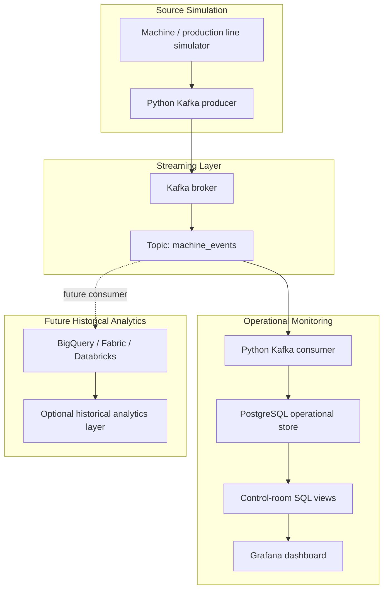

# Technical README

Shell convention: `powershell` examples run on Windows. `bash` examples run on the Ubuntu VM or, for optional local development, inside WSL; they are not native PowerShell commands. WSL and a local pipeline are not required for the cloud-first workflow.

This cloud-first project runs Kafka, Python, PostgreSQL, and Grafana on a scheduled GCP VM. Windows is used for source files, browser access, and occasional CLI administration. Local execution is optional development.

It reuses the same machine-generated manufacturing story as the earlier QR printing analytics project, but the architecture is different: this project focuses on Kafka streaming, operational monitoring, alert visibility, and a control-room style dashboard.

## Current Status

Phase 1 local pipeline is working, and the same stack has been moved to a Singapore GCP Compute Engine VM for cloud testing. The VM now uses a scheduled UAT/demo runtime instead of running 24/7.

Validated locally:

- Kafka container is running with `apache/kafka:3.7.0`.
- PostgreSQL container is running with `postgres:16`.
- Kafka topic `machine_events` exists.
- Python producer can publish simulated machine events.
- Python consumer can consume Kafka events and write them to PostgreSQL.
- PostgreSQL operational and control-room views are created.
- Grafana container is running on `http://localhost:3000`.
- Grafana PostgreSQL datasource is provisioned.
- Grafana dashboard `Kafka Machine Monitoring Control Room` is provisioned.
- Grafana local alert rules are provisioned for critical plant state and high ingest lag.
- Grafana Gmail email contact point is provisioned and verified.
- Gmail SMTP is configured in local `.env`; the App Password is kept out of Git.
- Real Grafana alert email delivery was tested with `Plant State Critical`.
- Alert email content now includes operations-friendly summary, impact, action plan, dashboard link, and resolution note.
- Alert email dashboard links use `GRAFANA_ROOT_URL=http://136.110.54.120:3000`.
- Fast local test inserted 60 rows into PostgreSQL.
- Latest tested control-room result returned `CRITICAL` because the test data intentionally reached a 10.00% failure rate.
- GCP Singapore VM `kafka-postgres-bi-sg` is running on `e2-small`.
- VM Grafana is reachable from the Windows workstation through `http://localhost:3001` using an SSH tunnel.
- Compute Engine instance schedule starts the VM every Saturday at 08:45 and stops it at 11:00 Asia/Bangkok.
- VM startup script starts Docker Compose automatically after scheduled start.
- VM pre-shutdown export service writes PostgreSQL snapshots to GCS before the scheduled stop.

The current result is good for the demo because it proves the monitoring layer reacts to warning and critical conditions.

Grafana local access:

```text
URL: http://localhost:3000
User: admin
Password: admin
Dashboard: Kafka Monitoring / Kafka Machine Monitoring Control Room
```

GCP Singapore access through SSH tunnels:

```text
Grafana URL: http://localhost:3001
VM: kafka-postgres-bi-sg, asia-southeast1-a
```

Public VM dashboard URL used in alert emails:

```text
http://136.110.54.120:3000/d/kafka-machine-monitoring/kafka-machine-monitoring-control-room
```

## Business Objective

Manufacturing teams need near real-time visibility into production events, machine status, warnings, faults, and quality signals.

This demo answers:

- Are machines producing events continuously?
- Is Kafka receiving events from the producer?
- Is the consumer writing events into PostgreSQL?
- Are failures or warnings increasing?
- Which machines need attention now?
- Is the dashboard reading fresh operational data?
- Can the same event stream support future historical analytics?

## Architecture



## Tech Stack

- Docker Compose
- Apache Kafka in single-node KRaft mode, no Zookeeper
- PostgreSQL 16 container
- Dockerized Python producer and consumer
- Grafana for the monitoring dashboard
- Future historical layer: BigQuery, Fabric, or Databricks

## Data Rate

Default low-cost producer mode:

```text
10 events every 60 seconds
```

Expected volume:

```text
600 events/hour
14,400 events/day
```

This is small enough for a low-cost VM demo but active enough to make a dashboard feel live.

Cloud runtime is intentionally scheduled:

```text
Every Saturday
08:45 Asia/Bangkok - VM starts
startup script - Docker Compose stack starts
09:00-11:00 - UAT/demo window
11:00 Asia/Bangkok - VM stops
```

## Quick Start

Fastest path (PowerShell, no WSL) - start the local Docker stack:

```powershell
docker compose up -d
docker compose ps
```

Local Grafana: `http://localhost:3000` (`admin` / `admin`). Local runs no alerting and publishes PostgreSQL on host port `5433` (see `docker-compose.override.yml`). The Python `.venv` and `scripts/*.sh` below are optional helpers for a WSL or Git Bash shell.

Create the Python environment:

```bash
python3 -m venv .venv
source .venv/bin/activate
pip install -r requirements.txt
cp .env.example .env
```

Start Kafka, PostgreSQL, Grafana, producer, and consumer:

```bash
scripts/start_services.sh
scripts/create_topics.sh
```

Confirm all services are running:

```bash
docker compose ps
```

Fast test mode:

```bash
PRODUCER_EVENT_INTERVAL_SECONDS=1 PRODUCER_EVENTS_PER_BATCH=10 PRODUCER_MAX_BATCHES=3 .venv/bin/python producer/machine_event_producer.py
```

Verify PostgreSQL:

```bash
scripts/verify_postgres_counts.sh
scripts/query_postgres.sh "SELECT * FROM control_room_current_status;"
scripts/query_postgres.sh "SELECT * FROM control_room_alert_feed ORDER BY event_time DESC LIMIT 20;"
```

## Grafana Access

Open:

```text
http://localhost:3000
```

Login:

```text
User: admin
Password: admin
```

The first dashboard is provisioned as code:

```text
Kafka Monitoring / Kafka Machine Monitoring Control Room
```

## PostgreSQL Connection

Grafana connects to PostgreSQL inside Docker using `postgres:5432`, defined in `grafana/provisioning/datasources/postgres.yml`.

On the running VM, use browser SSH and `sudo docker exec -it kafka_vm_postgres psql -U monitoring_user -d machine_monitoring` for occasional SQL checks. No database tunnel is required.

Optional local-development SQL helper:

```bash
scripts/query_postgres.sh
scripts/query_postgres.sh "SELECT COUNT(*) FROM machine_events_raw;"
```

No native PostgreSQL install is required on the Windows workstation because PostgreSQL runs in Docker.

## Repository Map

- `Kafka_Real_Time_Monitoring_Project.md` - original project brief and target architecture.
- `Dockerfile` - Python image used by the producer and consumer containers.
- `docker-compose.yml` - Kafka, PostgreSQL, Grafana, producer, consumer, and LINE alert bridge services.
- `docker-compose.override.yml` - local-only overrides (PostgreSQL host port 5433, alerting excluded). Auto-merged by `docker compose`; keeps `docker-compose.yml` identical to the VM.
- `.env.example` - default local connection and producer settings; copy to `.env`.
- `producer/` - Python event producer for simulated machine data.
- `consumer/` - Python Kafka consumer that validates and writes events to PostgreSQL.
- `sql/` - PostgreSQL schema, control-room model, and dashboard queries.
- `grafana/` - Grafana datasource provisioning and dashboard JSON.
- `grafana/provisioning/alerting/kafka_alert_rules.yml` - local Grafana alert rules.
- `grafana/provisioning/alerting/gmail_contact_point.yml` - Grafana Gmail contact point and notification policy.
- `scripts/` - setup, run, reset, and verification helpers.
- `docs/` - detailed runbooks, data model, KPI, dashboard, infrastructure, and GCP notes.
- `docs/screenshots/` - screenshots for final portfolio presentation.

## Main PostgreSQL Objects

- `machine_events_raw` - raw event storage table.
- `production_events` - production/QR printing event view.
- `machine_status_minute` - minute-level machine metrics.
- `machine_alerts` - warning and failed event view.
- `monitoring_rules` - threshold reference table.
- `control_room_current_status` - top-level dashboard status.
- `control_room_machine_status` - machine-level status board.
- `control_room_alert_feed` - live alert feed for suspicious activity.
- `dashboard_realtime_summary` - simple real-time KPI summary.

## Deep Dive Docs

- [Original project brief](../Kafka_Real_Time_Monitoring_Project.md)
- [Local runbook](local_runbook.md)
- [Current project status](current_status.md)
- [Implementation details](project_implementation_details.md)
- [Database model](database_model.md)
- [Grafana dashboard plan](grafana_dashboard_plan.md)
- [KPI definitions](kpi_definitions.md)
- [Alerting and monitoring](alerting_monitoring.md)
- [Infrastructure resources](infrastructure_resources.md)
- [GCP VM setup](gcp_vm_setup.md)
- [GCP VM operations runbook](gcp_vm_operations.md)
- [GCP cost plan](gcp_cost_plan.md)

## Next Build Step

Keep testing the Singapore `e2-small` VM during the scheduled UAT window and monitor capacity. Gmail and LINE broadcast alerting are complete for the current design. The next optional alerting enhancement is true LINE group-chat push or a future Cloud Run alert bridge if the project needs a more production-style integration layer.
